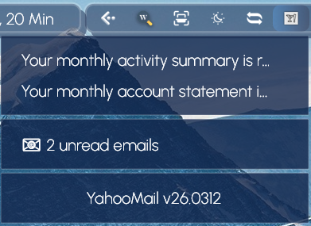

<h1 align="center">
   
  
   
  Yahoo Mail
   
</h1>

<h4 align="center">Get a notification when you have new emails on your Yahoo Mail account.</h4>

  <a href="https://droptopfour.com/community-apps"><!--img alt="Dynamic JSON Badge" src="https://img.shields.io/badge/dynamic/json?url=https%3A%2F%2Fapi.droptopfour.com%2Fv1%2Fcommunity-apps%2F&query=%24%5B64%5D%5B'version'%5D&label=Version&color=43ff64"--></a>
  
  
  <!--img alt="Dynamic JSON Badge" src="https://img.shields.io/badge/dynamic/json?url=https%3A%2F%2Fapi.droptopfour.com%2Fv1%2Fcommunity-apps%2F&query=%24%5B64%5D%5B'downloads'%5D&label=Downloads&color=d8624c"-->

  <a href="#key-features">Key Features</a> •
  <a href="#how-to-use">How To Use</a> •
  <a href="#download">Download</a> •
  <a href="#credits">Credits</a> •
  <a href="#license">License</a>

## Key Features
• Shows new email count on the icon in the Droptop bar.
• When the icon is clicked, shows email sender and subject of each email up to five.

## How to use
• Install and activate the app.  
• Right Click and go into settings.  
• Follow instructions to create a Yahoo 3rd party app password.

## Download
[Droptop Four Community Apps](https://droptopfour.com/community-apps/)

## Credits
Written by [TheyCallMePapa](https://github.com/papa-boynton)

## License
Creative Commons Attribution-Non-Commercial-Share Alike 3.0
